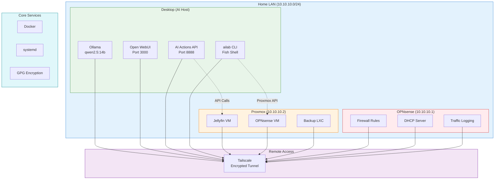

# 🤖 AI Lab - Self-Hosted AI Automation

[](https://github.com/kuangronald/ai-lab)
[](https://github.com/kuangronald/ai-lab)
[](https://github.com/kuangronald/ai-lab)

> A private, offline, GPU-accelerated AI automation system with full infrastructure integration
---

## 📋 Table of Contents

- [Overview](#-overview)
- [Features](#-features)
- [Architecture](#-architecture)
- [Core Services](#-core-services)
- [Quick Start](#-quick-start)
- [Basic Commands](#-basic-commands)
- [Command Reference](#-command-reference)
- [Direct Script Access](#-direct-script-access)
- [Quick Diagnostics](#-quick-diagnostics)
- [Common Workflows](#-common-workflows)
- [Configuration](#-configuration)
- [Security](#-security)
- [Backup & Recovery](#-backup--recovery)
- [Troubleshooting](#-troubleshooting)
- [License](#-license)

---

## 📖 Overview

This AI Lab provides **4 levels of AI assistance** for managing self-hosted infrastructure:

| Level | Capability | Example Command |
|-------|------------|-----------------|
| **1** | Chat Interface | `ailab chat` |
| **2** | Git-Tracked Config Editing | `ailab edit FILE` |
| **3** | System File Editing | `ailab sysedit FILE` |
| **4** | Infrastructure Automation | `ailab proxmox status` |

---

## ✨ Features

- 🏠 **100% Local & Private** — All AI runs offline via Ollama
- 🎮 **GPU-Accelerated** — AMD RX 6700 XT (12GB VRAM)
- 🔐 **Encrypted Backups** — GPG-encrypted daily backups
- 📊 **Health Monitoring** — Automated checks with Telegram alerts
- 🎛️ **Proxmox Integration** — Control VMs via API
- 🧠 **Conversation Memory** — AI remembers lab context
- 🔀 **Git-Tracked** — All config changes versioned & audited
- 🌐 **Remote Access** — Tailscale for secure remote management

---

## 🏗️  Architecture


---

## Core Services

| Service | Port | Purpose |
|---------|------|---------|
| Ollama | 11434 | Local LLM inference |
| Open WebUI | 3000 | Chat interface |
| AI Actions API | 8888 | Automation API |
| Proxmox API | 8006 | VM management |

---

## 🚀 Quick Start

### Prerequisites

- CachyOS/Arch Linux
- AMD GPU (or NVIDIA with CUDA)
- Proxmox VE (optional)
- Tailscale account

### Installation

```bash
# 1. Install Ollama
curl -fsSL https://ollama.com/install.sh | sh

# 2. Pull AI model
ollama pull qwen2.5:14b

# 3. Install Open WebUI
docker run -d -p 3000:8080 \
  --add-host=host.docker.internal:host-gateway \
  -v open-webui:/app/backend/data \
  --name open-webui --restart always \
  ghcr.io/open-webui/open-webui:main

# 4. Clone this repo
git clone https://github.com/kuangronald/ai-lab.git
cd ai-lab

# 5. Configure
cp examples/.env.example ~/ai-api/.env
nano ~/ai-api/.env

# 6. Install dependencies
./setup.sh
```
---

## 🔧 Basic Commands

| Command | Purpose |
|---------|---------|
|ailab health|# Check system health|
|ailab chat|# Open chat interface|
|ailab proxmox status|# List Proxmox VMs|
|ailab backup|# View backup status|

---

## 📚 Command Reference

MAIN AILAB COMMANDS:
| Command | Purpose |
|---------|---------|
|ailab chat|Open WebUI chat interface|
|ailab edit FILE|Git-tracked config editing (Level 2)|
|ailab sysedit FILE|System file editing with backup (Level 3)|
|ailab status|Quick service status check|
|ailab health|Full health dashboard|
|ailab backup|Backup status|
|ailab memory|View/edit AI memory|
|ailab remember 'fact'|Add note to AI memory|
|ailab monitor|Live GPU stats|
|ailab proxmox health|Check Proxmox API connection|
|ailab proxmox status|List all Proxmox VMs|
|ailab proxmox start ID|Start a VM (e.g., ailab proxmox start 102)|
|ailab proxmox stop ID|Stop a VM (e.g., ailab proxmox stop 102)|

---

## DIRECT SCRIPT ACCESS:

~/bin/ailab-proxmox.sh        → Proxmox API helper
~/bin/ai-lab-healthcheck.sh   → Health monitoring
~/bin/ai-lab-backup.sh        → Backup automation
~/bin/ai-lab-alert.sh         → Telegram alerts

---

## 🔍 Quick Diagnostics

| Command | Purpose |
|---------|---------|
|ailab health|Check all services at once|
|tail -20 ~/logs/*.log|View recent logs|
|systemctl status ollama|Check Ollama service|
|systemctl status docker|Check Docker service|
|~/bin/ailab-proxmox.sh debug|Debug Proxmox connection|

---

## 🔄 Common Workflows

### Start your day

ailab health

ailab proxmox status

### Edit a config safely
ailab edit ~/lab-configs/somefile.conf

### Check backups
ailab backup

### Monitor GPU during AI work
ailab monitor

### Remote access (from laptop via Tailscale)

ssh user@TailscaleIP

ailab health

---

## 📄 License
Personal Use Only — This is my personal infrastructure automation setup. Feel free to use ideas and patterns for your own projects.
<div align="center">

---

Made with ❤️ for the self-hosted community
⭐ Star this repo if you found it useful!
</div>

